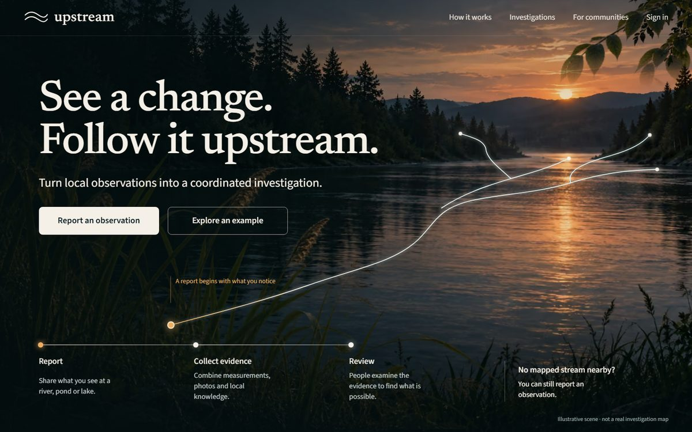
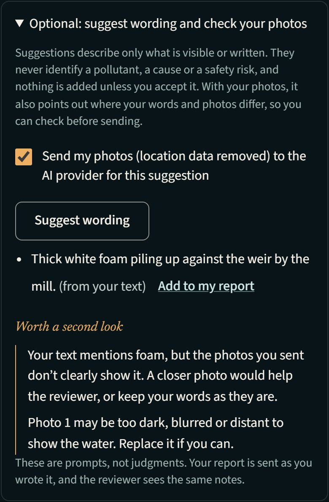
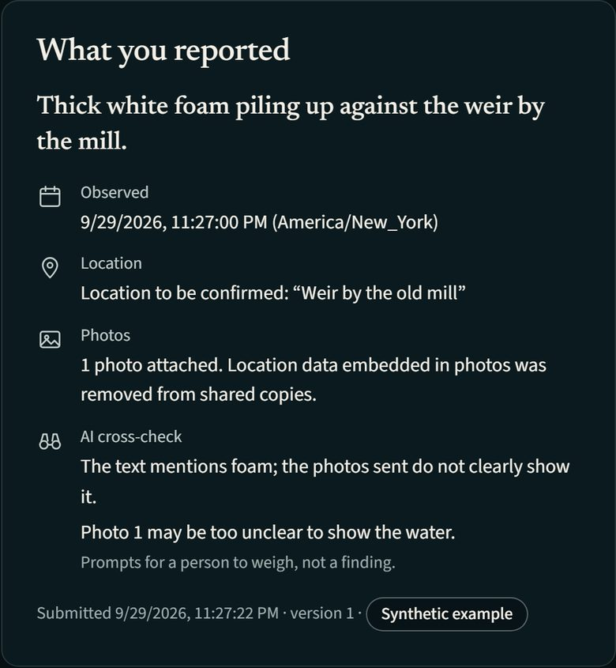
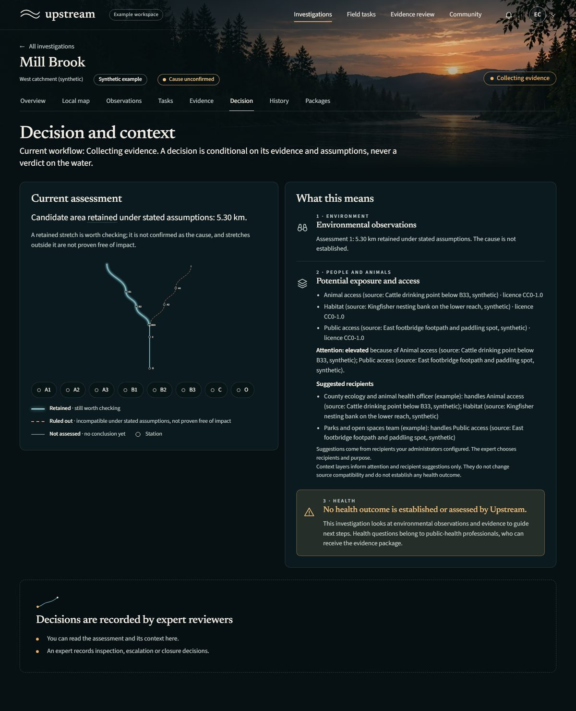
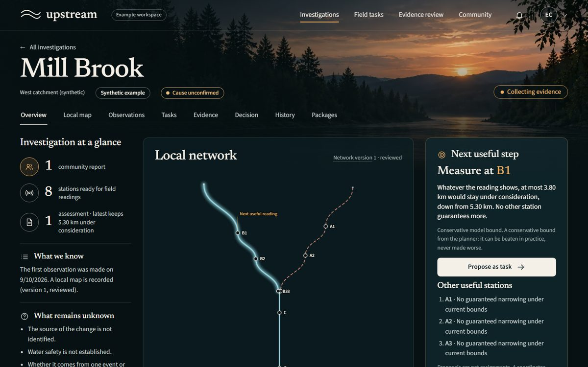
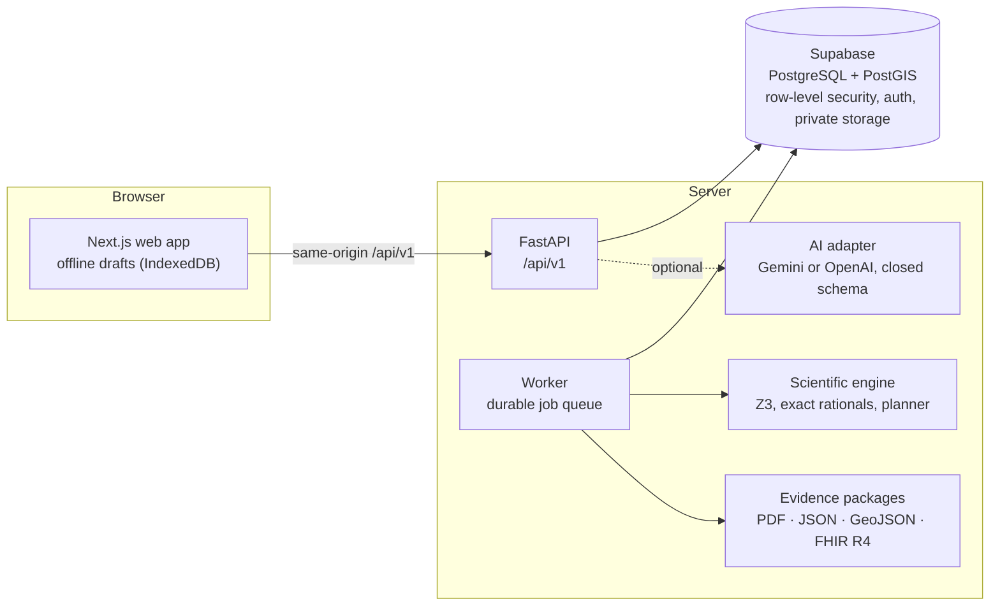

# Upstream

**See a change. Follow it upstream.**

Upstream turns a citizen's note about an urban stream (foam at a weir, water that changed colour, an outflow that wasn't
there last week) into a coordinated investigation that a community, trained monitors and an expert reviewer can carry
through together, and that a public-health or environmental team can receive as a validated evidence package.

> **IEEE OneAquaHealth Global Hackathon 2026 · Track 3: AI-Supported Assessment.**
> AI helps people describe what they saw and checks their words against their photos. Exact, reproducible code decides
> what the evidence rules out. Qualified people make every consequential decision. Nothing the AI says can change a
> scientific result or approve a case.



## The problem

Citizen observations are the earliest warning an urban stream gets, but they are hard to act on. Reports are inconsistent
(the text says foam, the photo shows none), they arrive for streams with no official name or monitoring stations, and
turning them into evidence someone can use means knowing *where to measure next*. Most tools either collect reports that
nobody can act on, or produce confident-looking conclusions the data cannot support.

## What Upstream does

**report → check readiness → choose useful evidence → collect → review → revise → share**

1. **Report.** Anyone can report a change in plain language, with photos, even on an unnamed, unmapped stream. Drafts are
   kept on the device and sent when the connection returns.
2. **Check readiness.** Before any conclusion, the case lists what is missing (a mapped reach, a background range, a
   qualified monitor, a calibrated instrument) and which role can fix each gap.
3. **Choose useful evidence.** A planner proposes the next station to measure and says in plain words why that reading
   would narrow the search most. A coordinator decides; nothing is assigned automatically.
4. **Collect and review.** Trained monitors record conductivity readings against calibrated instruments; each reading is
   quality-reviewed before it can count.
5. **Revise.** An exact engine shows which stretches of the stream are **ruled out** (incompatible with the readings under
   the stated assumptions) and which are **retained** (worth checking), with the reading that ruled each stretch out and
   why. New evidence produces a new revision; nothing is silently overwritten.
6. **Share.** An expert approves a revision and sends a signed evidence package (PDF, JSON, GeoJSON and HL7 FHIR R4) to a
   recipient, who acknowledges the specific revision they received.

| Contributor: the AI cross-check before sending | Reviewer: the same notes on the submitted report |
|---|---|
|  |  |

| Decision view: ruled out, retained, and the One Health context | Case workspace: readiness and the next useful station |
|---|---|
|  |  |

## Track 3: how AI supports assessment without replacing judgment

| Track 3 asks for | What Upstream does |
|---|---|
| **AI prompts** | An optional assistant proposes wording for what is *visible or written* (foam, colour change, debris, a pipe or outflow, wildlife) and asks for missing detail. It never names a pollutant, a cause, a source or a health effect. Each suggestion says which input it came from ("from your text", "from a photo"). |
| **Validation checks** | **AI cross-check:** when the contributor chooses to send photos, Upstream compares what the text says with what the photos show and lists the differences in plain words ("Your text mentions foam, but the photos you sent don't clearly show it"; "Photo 1 may be too blurred to show the water"). The comparison is deterministic code over the AI's cited inputs, so the same answer always produces the same prompts. Alongside it, readiness checks name what is missing and who fixes it, and every reading is quality-reviewed. |
| **Explainable AI** | **Case summary with checked citations:** on any case, a person can ask for a few plain sentences about where it stands. The model sees only structured records (report categories and dates, readings with their quality decision, the engine's assessment, the planner's next visit), never contributors' own words or photos. Every sentence cites the records it rests on, and the server rejects the whole answer if a citation does not exist, a number is not in the cited record, or it claims a cause, a source, safety or health; a fixed template then stands in, and the panel says which one you are reading. Every AI statement cites its input. Scientific conclusions come from an exact engine (Z3 with rational arithmetic), never from a model, and each ruled-out stretch names the reading and the assumption that ruled it out. No confidence percentages are invented. |
| **Human in the loop** | Nothing the AI suggests enters a report unless the person accepts it. Cross-check prompts never block sending. The reviewer sees the same notes and which wording came from the AI. A coordinator assigns work, an expert approves each revision, and the recipient acknowledges it. |

Guardrails, each covered by automated tests (`tests/api/test_ai.py`): the provider gets no tools and must answer in a closed
schema; report text is passed as quoted data, so instructions hidden in a report cannot act; an answer that cites an input
it was not given, adds a field, or names a diagnosis is rejected whole; photos are sent only with explicit consent and with
location data removed; each run records the provider, the model version the provider reports, the inputs' hashes and what
the person accepted. If the provider is unavailable, the form says so and reporting continues by hand.

## One Health: shown, not claimed

Upstream keeps three things separate on every decision:

1. **Environmental observations**: what was reported and measured, and which stretches the evidence rules out or retains.
2. **Potential exposure and access for people and animals**: footpaths, swimming spots, grazing and drinking points and
   downstream habitats, each recorded with its source and licence. These layers decide where attention goes first; they
   never change the physical result.
3. **Health**: no health outcome is established or assessed by Upstream. Health questions belong to public-health
   professionals, who can receive the evidence package.

## Interoperability and reliability

- **HL7 FHIR R4:** evidence packages include a FHIR bundle (Observation, Device, Location, DocumentReference, Provenance, Organization) built on
  the OneAquaHealth FHIR IG profiles (LocationOah stations, ObservationIndicatorsOah conductivity readings) that passes
  the official HL7 validator with 0 errors ([docs/fhir-validation.md](docs/fhir-validation.md)). People are kept
  pseudonymous: no Patient or Practitioner resources.
- **Signed, traceable packages:** Ed25519 signatures, a hashed manifest, and revision notices that recipients acknowledge.
- **Works where the map doesn't:** reports on unnamed and unmapped waterways, local network onboarding, and honest
  "not ready" states instead of guesses (tidal and unmapped example cases included).
- **Offline-first reporting:** drafts and readings are saved on the device and synchronized exactly once.
- **Keyless by default:** OpenFreeMap basemap, local email catcher, AI optional (Gemini or OpenAI).
- **Verified:** 146 of 146 release gates pass with test evidence ([docs/release-results.md](docs/release-results.md)),
  from about 250 automated tests: scientific engine, API and database security, browser workflows, accessibility (axe,
  keyboard, screen-reader labels, reduced motion) and performance (mobile LCP 2.3 s against a 2.5 s budget).

## Architecture



Next.js (App Router, TypeScript) in `apps/web` · FastAPI in `services/api` · durable PostgreSQL job worker in
`services/worker` · pure scientific engine in `packages/engine` · evidence packages/FHIR in `services/packages` ·
Supabase (PostgreSQL + PostGIS, Auth, private storage) with migrations in `supabase/migrations`. Authorization lives in
the database (row-level security and command functions); the browser can never approve an assessment or change a result.

Specification: [docs/specification](docs/specification) (product, scientific engine, acceptance gates). Build record:
[docs/progress.md](docs/progress.md).

## Try it locally

Requirements: Node 24, pnpm 11 (without a global pnpm, use `npx pnpm@11.19.0` wherever `pnpm` appears), Python 3.12,
Docker (for the local Supabase stack). On Windows, clone into a short path such as `C:\src\upstream`: deep folders hit the
Windows path-length limit inside `node_modules`.

```sh
pnpm install
python -m venv .venv && .venv/Scripts/python -m pip install -r requirements.lock   # macOS/Linux: .venv/bin/python
.venv/Scripts/python -m playwright install chromium                               # PDF export and browser tests
cp .env.example .env
```

The `pnpm` scripts call `python scripts/local.py …`; run them with the virtual environment activated
(`.venv\Scripts\activate` on Windows, `source .venv/bin/activate` elsewhere).

```sh
pnpm setup:local           # supabase start + migration up --local, then writes the local keys into blank .env entries
pnpm seed:example          # synthetic example workspace (idempotent; refuses non-local or production databases)
pnpm dev                   # API :8000, worker, web :3000 (web proxies /api/v1 to the API)
pnpm reset:example         # rebuild the local database and reseed (local only)
```

Open http://127.0.0.1:3000. Example accounts (local example workspace only, synthetic data):
`coordinator@example.test`, `expert@example.test`, `monitor@example.test`, `contributor@example.test`,
`admin@example.test`, password `upstream-example-only`. Production refuses `EXAMPLE_MODE=true`.
Evidence packages are unsigned unless `EXPORT_SIGNING_KEY_ID` and `EXPORT_SIGNING_PRIVATE_KEY` are set (see `docs/runbook.md`).

A good path through the example: sign in as `contributor@example.test` and report an observation with a photo, using
"Optional: suggest wording and check your photos"; then sign in as `coordinator@example.test` and open **Mill Brook**:
overview, local map, tasks, observations, evidence and decision.

No paid map, AI or email service is needed: the default basemap is OpenFreeMap (no key, account or payment; leave
`MAP_STYLE_URL` empty for a plain background, and rebuild the web app after changing it); local email goes to the
Supabase mail catcher. Without an AI key the assistant is shown as unavailable and everything else works. To turn it on
with a free Gemini key from Google AI Studio, set in `.env`:

```sh
AI_PROVIDER=gemini
AI_BASE_URL=https://generativelanguage.googleapis.com/v1beta
AI_MODEL=gemini-3.5-flash-lite
AI_API_KEY=your-key
```

## Tests

```sh
.venv/Scripts/python -m pytest tests -q -p no:cacheprovider -rA   # everything (needs local Supabase + seed; browser tests
                                                                  # need `pnpm build`, API, worker and `next start` running)
pnpm test:engine            # scientific engine and property tests
pnpm test                   # API/package/security tests + web typecheck
pnpm test:e2e               # browser workflows
python scripts/secret_scan.py          # no privileged keys in the browser build or tracked files
python scripts/update_release_results.py   # refresh docs/release-results.md after a full run
```

On Windows, `powershell -ExecutionPolicy Bypass -File scripts/restart-local.ps1` restarts API, worker and `next start`.

## Limits, stated plainly

- Upstream has not been validated in the field. All example cases are synthetic and labelled as such everywhere.
- The engine's claim is conditional compatibility in a reviewed, non-tidal local stream network during a comparable
  event. It is not pollutant identification, laboratory chemistry, source responsibility or a statement about water
  safety or health.
- The case summary is reading help, not a finding: its checks catch invented records, numbers and forbidden claims, not every awkward phrasing.
- The AI describes only what is visible or written. Its cross-check is a prompt for a person, and a model can miss or
  misread what a photo shows; that is why it never blocks, changes or scores a report.
- There is no data integration with the OneAquaHealth Citizen Science App or its API yet. Its field protocol records water
  conductivity in µS/cm (`WCON_US`), the reading Upstream's engine uses, but those submissions require authorized access
  (checked 2026-10-04); the public endpoints carry sites, ecological status, health-risk scores and weather. Packages
  conform to the OneAquaHealth FHIR IG's location and indicator profiles, which is where such a mapping would attach.

## Operations and license

See [docs/runbook.md](docs/runbook.md) for production setup (first organization and administrator), deployment, key
rotation, backup/restore and rollback. Released under the [MIT License](LICENSE); bundled fonts keep their own licenses in
`apps/web/public/licenses`.
